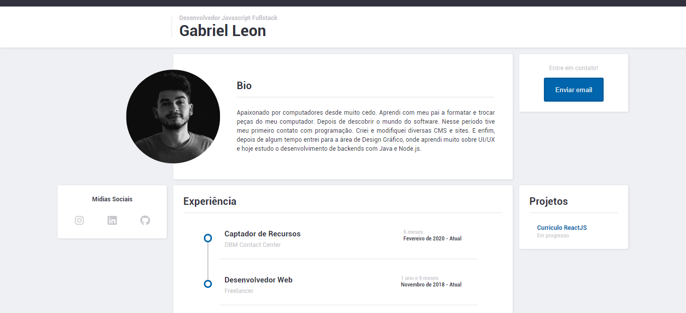

# Currículo ReactJS & Node.js
> Um site simples, que apresenta informações pessoais e de formação sobre alguém.

License [MIT]

Este site é bem simples, usa ReactJS para composição da página e seus componentes, Node.js para requisições backend feitas pelo Administrador e Redux para controlar o estado global da aplicação.(_Em caso de dúvidas entrar em [contato][contato]._)



## Necessário para instalação
OS X & Linux & Windows:
- Yarn/NPM
- Node.js ^v12.18.2
-
> Comando para instalar os pacotes com Yarn
```sh
    yarn
```
> Comando para instalar os pacotes com NPM
```sh
    npm install
```

## Exemplo de uso
Roda o servidor para desenvolvimento
```sh
    yarn start
```

Cria os arquivos para produção
```sh
    yarn build
```

_Para mais informações acesse [Create-React-App][react-app]._

## Histórico de lançamentos

* 0.0.1
    * Versão estática, sem backend, apenas ReactJS & Redux.

## Meta

Gabriel Leon – [@gabeleonn](https://instagram.com/gabeleonn) – _[gableonn@gmail.com][contato]._
[https://github.com/gabeleonn/](https://github.com/gabeleonn/)
---
Distribuído sob a licença MIT. Entre em [contato][contato] para mais informações.


## Contributing

1. Faça o _fork_ do projeto (<https://github.com/gabeleonn/resume-app/fork>)
2. Crie uma _branch_ para sua modificação (`git checkout -b feature/fooBar`)
3. Faça o _commit_ (`git commit -m 'Type: Add some fooBar'`)
4. _Push_ (`git push origin feature/fooBar`)
5. Crie um novo _Pull Request_

[contato]: mailto:gableonn@gmail.com
[react-app]: https://create-react-app.dev/docs/getting-started/
